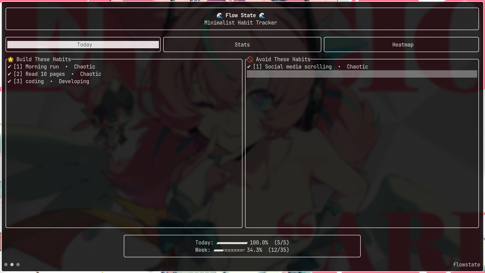
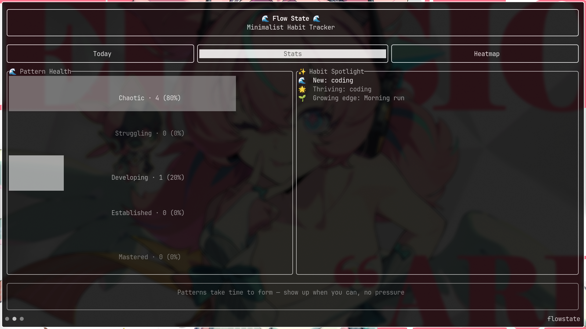
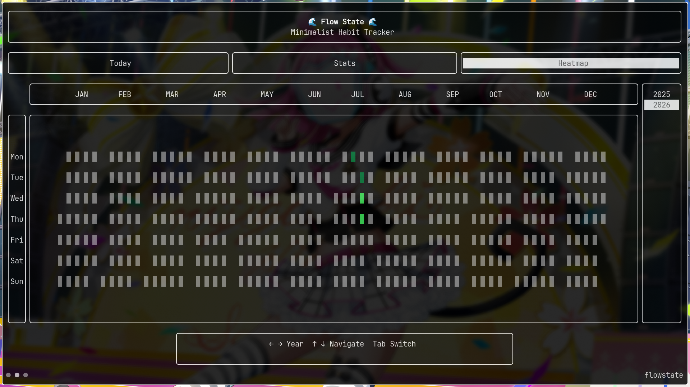

# Flow State

A terminal habit tracker for neurodivergent brains. Tracks patterns, not streaks — missing a day doesn't reset your progress.


*Today — check off habits, see today/week progress*


*Stats — pattern health and habit spotlight*


*Heatmap — yearly completion calendar*

## Why

Most habit trackers punish a single missed day with a broken streak. That's a bad fit for ADHD and executive dysfunction. Flow State looks at your weekly pattern instead of demanding perfect consistency, and it never scolds you for having an off week.

## Features

- **Pattern-based tracking** — weekly patterns instead of breakable streaks
- **Dual habit types** — habits to build, habits to avoid
- **Gentle notifications** — one reminder if you've gone quiet, one cheer if you're crushing it, silence otherwise
- **Holidays** — mark a date range per habit so missed days don't count against your pattern
- **Chronotype-aware day boundary** — night owl? Push "today" past midnight instead of losing progress at the stroke of 12
- **Local-only storage** — plain TOML files, no accounts, no cloud
- **Keyboard-driven** — minimal, vim-motion navigation

## Pattern tiers

Instead of streaks, each habit gets a weekly consistency score:

| Tier | Meaning |
|---|---|
| 🌟 Mastered | Strong, consistent pattern |
| 🌳 Established | Good momentum |
| 🌿 Developing | Pattern forming |
| 🌱 Struggling | Frequent relapse |
| 🌫️ Chaotic | Inconsistent — no judgment, just data |

## Install

```bash
cargo install flow_state
```

Or from source:

```bash
git clone https://github.com/Stan-breaks/flow_state
cd flow_state
cargo build --release
```

## Usage

```bash
flow_state
```

| Key | Action |
|---|---|
| `TAB` | Switch view (Today / Stats / Heatmap) |
| `ENTER` | Toggle habit |
| `y` | Edit yesterday instead of today |
| `H` | Mark a holiday range for the selected habit |
| `hjkl` | Navigate |
| `?` | Show all keymaps |
| `q` | Quit |

## Notifications

Off by default. To enable, create `.config/flow_state/notification.toml` with `enable = true`, a daily `hour`/`minute`, and `low_threshold` / `high_threshold`. You'll get a nudge if completion is under `low_threshold`, a cheer if it's over `high_threshold`, and nothing in between. A ready-made config lives at `config/notification.toml`.

The same file also holds `day_cutoff_hour` (default `0`). It's the number of hours past midnight that still count as "yesterday" — set it to `2` and your day doesn't roll over until 2am local time, for whenever midnight doesn't match your actual day.

## Stack

Rust · [ratatui](https://ratatui.rs) · TOML storage · Linux/macOS/Windows

## Contributing

PRs welcome, especially from neurodivergent developers who know the target use case firsthand. Accessibility and ADHD-friendly UX changes get priority.
